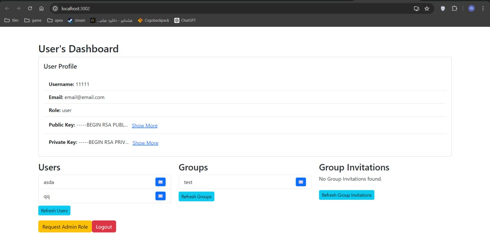
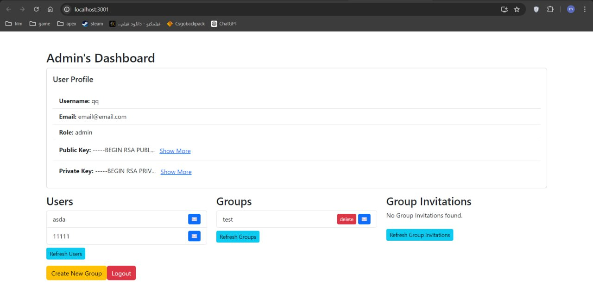
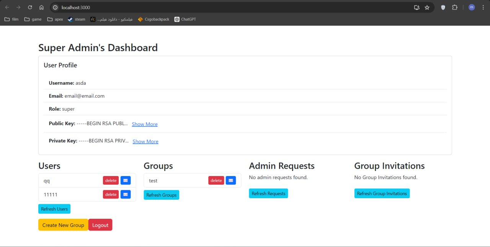
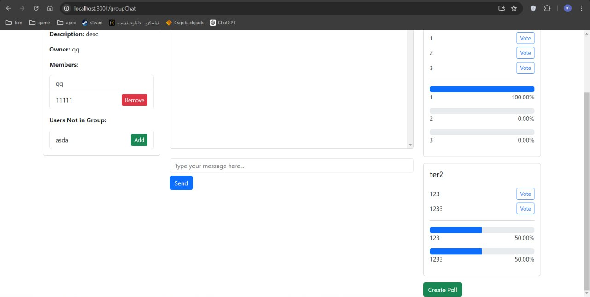

# Table of Contents
- [Table of Contents](#table-of-contents)
- [Overview](#overview)
- [Setup](#setup)
  - [Prerequisites](#prerequisites)
  - [Client Prerequisites](#client-prerequisites)
  - [Server Prerequisites](#server-prerequisites)
  - [Installation](#installation)
- [Project Structure](#project-structure)
  - [Client](#client)
  - [Server](#server)
  - [User Roles](#user-roles)
    - [Login Process](#login-process)
    - [Admin Request Process](#admin-request-process)
  - [1. Regular User Dashboard](#1-regular-user-dashboard)
    - [1.1. Profile View](#11-profile-view)
    - [1.2. Messaging Interface](#12-messaging-interface)
    - [1.3. Group Join Requests](#13-group-join-requests)
  - [2. Admin Dashboard](#2-admin-dashboard)
    - [2.1. Group Management](#21-group-management)
    - [2.2. User Invitations](#22-user-invitations)
  - [3. Super Admin Dashboard](#3-super-admin-dashboard)
    - [3.1. System Overview](#31-system-overview)
    - [3.2. User Management](#32-user-management)
    - [3.3. Group Oversight](#33-group-oversight)
    - [3.4. Privacy Restrictions](#34-privacy-restrictions)
    - [Invitation System](#invitation-system)
  - [Group and Poll Certificates](#group-and-poll-certificates)
- [Project Features](#project-features)
    - [Logging and Monitoring](#logging-and-monitoring)
    - [Integrity Verification](#integrity-verification)
    - [Security Measures](#security-measures)
    - [API and Data Access](#api-and-data-access)
  - [Error Handling](#error-handling)
  - [Key Management](#key-management)
  - [Session Management Methods](#session-management-methods)
  - [Route-Specific Authentication](#route-specific-authentication)
  - [Middleware Layers](#middleware-layers)
  - [HTTP Server (Express Server)](#http-server-express-server)
  - [Socket Server](#socket-server)
- [Phase 2](#phase-2)
  - [1. Authentication and Authorization Tokens](#1-authentication-and-authorization-tokens)
    - [Security Asset](#security-asset)
    - [Threats](#threats)
    - [Our Solutions](#our-solutions)
  - [2. User Role Management](#2-user-role-management)
    - [Security Asset](#security-asset-1)
    - [Threats](#threats-1)
    - [Our Solutions](#our-solutions-1)
  - [3. Certificate and Invitation System](#3-certificate-and-invitation-system)
    - [Security Asset](#security-asset-2)
    - [Threats](#threats-2)
    - [Our Solutions](#our-solutions-2)
  - [4. Middleware and Access Control](#4-middleware-and-access-control)
    - [Security Asset](#security-asset-3)
    - [Threats](#threats-3)
    - [Our Solutions](#our-solutions-3)
  - [5. HTTP and Socket Server Architecture](#5-http-and-socket-server-architecture)
    - [Security Asset](#security-asset-4)
    - [Threats](#threats-4)
    - [Our Solutions](#our-solutions-4)
  - [6. Logging and Error Handling](#6-logging-and-error-handling)
    - [Security Asset](#security-asset-5)
    - [Threats](#threats-5)
    - [Our Solutions](#our-solutions-5)


# Overview
SecureChat is a secure real-time private and group chat application designed with robust authentication mechanisms and support for different user roles. Key features include message encoding, signing for enhanced security, and real-time communication capabilities. The project utilizes React for the frontend and Node.js for the backend. Setup involves running npm install in both the server and client directories. SecureChat aims to provide a secure and efficient platform for private and group communications.

# Setup

## Prerequisites
Ensure you have Node.js and npm installed on your system. This project requires the following dependencies for both the client and server:

## Client Prerequisites
- @testing-library/jest-dom
- @testing-library/react
- @testing-library/user-event
- axios
- bootstrap
- dotenv
- node-forge
- react
- react-bootstrap
- react-dom
- react-router-dom
- react-scripts
- socket.io-client
- web-vitals

## Server Prerequisites
- bcryptjs
- cors
- crypto
- dotenv
- express
- jsonwebtoken
- mongoose
- node-forge
- nodemon
- socket.io
- winston

## Installation
1. Clone the repository or download the project files.
    ```bash
    git clone https://github.com/MAMMAD1381/SecureChat.git
    ```
2. Navigate to the client directory and install the required packages:
    ```bash
    cd client
    npm install
    ```
3. Navigate to the server directory and install the required packages:
    ```bash
    cd server
    npm install
    ```
4. Create a `.env` file in both the client and server directories with the necessary environment variables.


# Project Structure

## Client

```
client/
│
├── node_modules/
│
├── public/
│
├── src/
│   ├── components/
│   │   ├── auth/
│   │   ├── chats/
│   │   ├── dashboards/
│   │   ├── lists/
│   │   ├── GlobalMessage.js
│   │   ├── LandingPage.js
│   │   └── MessageContext.js
│   │
│   ├── controllers/
│   │   ├── admin.js
│   │   ├── auth.js
│   │   ├── group.js
│   │   └── user.js
│   │
│   ├── utils/
│   │   ├── Crypto.js
│   │   └── localStorage.js
│   │
│   ├── App.js
│   ├── env.js
│   ├── index.css
│   ├── index.js
│   └── reportWebVitals.js
│
├── .gitignore
├── package-lock.json
└── package.json
```

**Description**

- **components/**: Contains React components for various parts of the application.
- **controllers/**: Business logic and handling for different aspects like admin, auth, group, and user.
- **utils/**: Utility functions used throughout the client-side application.
- **App.js**: Main component for the client application.
- **index.js**: Entry point for the client application.
## Server

```
server/
│
├── node_modules/
│
├── servers/
│   ├── expressServer.js
│   └── socketServer.js
│
├── src/
│   ├── controllers/
│   │   ├── admin/
│   │   ├── group/
│   │   ├── poll/
│   │   ├── user/
│   │   └── socketController.js
│   │
│   ├── middlewares/
│   │   ├── authenticate.js
│   │   ├── authorize.js
│   │   ├── checkFields.js
│   │   └── socketAuth.js
│   │
│   ├── models/
│   │   ├── Cert.js
│   │   ├── Group.js
│   │   ├── GroupInvitation.js
│   │   ├── Poll.js
│   │   ├── RequestAdmin.js
│   │   ├── User.js
│   │   └── Vote.js
│   │
│   ├── routes/
│   │   ├── adminRoutes.js
│   │   ├── groupRoutes.js
│   │   ├── pollRoutes.js
│   │   ├── socketRoutes.js
│   │   └── userRoutes.js
│   │
│   ├── utils/
│   │   ├── connectDB.js
│   │   ├── Crypto.js
│   │   ├── CustomError.js
│   │   ├── errorHandler.js
│   │   ├── generateKeys.js
│   │   ├── jwt.js
│   │   └── logger.js
│
├── .env
├── .gitignore
├── package-lock.json
├── package.json
└── server.js
```

**Description**

- **controllers/**: Contains the server-side controllers handling different routes.
- **middlewares/**: Middleware functions for request processing.
- **models/**: Data models for the application's database.
- **routes/**: Defines the different API routes.
- **utils/**: Utility functions and helpers for the server-side application.
- **server.js**: Main entry point for the server application.

This structure should make it clear and easy to understand the layout and organization of your project.


## User Roles

- **Role Hierarchy**: The system supports three distinct roles:
  - **Super Admin**: The highest level of access, capable of performing all administrative tasks, including approving new Admins.
  - **Admin**: Can manage certain administrative tasks but cannot elevate other users to Admin or Super Admin status without approval from a Super Admin.
  - **Regular User**: Default role for all new registrations. Users start with basic access and can be elevated to Admin status.

- **Role Assignment in signin**:
  - **Default Assignment**: Upon registration, all users are assigned the Regular User role by default.
  - **Admin Elevation**: Users can be elevated to Admin status, but this change must be approved by a Super Admin.
  - **Super Admin Creation**: A user cannot directly create a Super Admin account. Instead, the first user to register in the system or database is automatically assigned the Super Admin role. This ensures that there is no direct method for creating additional Super Admins, thus limiting high-level access.


### Login Process

  The login process verifies the user's credentials and grants access to the system.

  <figure>
        
        <figcaption>Login and Sign in page</figcaption>
    </figure>

**Steps**
  1. **User Credentials**
      - Input: User provides their email or username and password.
      - Validation: System checks if the provided credentials match a registered user.
  2. **Token or Cookie Generation**
      - Token: A JWT is generated and returned to the user for API authentication.
      - Cookie: An HTTP-only cookie is set with the user's session token for web-based authentication.
  3. **Role Retrieval**
      - Role Check: User’s role is retrieved from the database to determine access level.
      - User Object: A user object containing role and permissions is appended to the session.
  4. **Session Management**
    - Expiration: Tokens and cookies have expiration times to ensure session security.
    - Secure Storage: Tokens and cookies are securely stored to prevent unauthorized access.

### Admin Request Process

- **Request Submission**:
  - **Initiated by Users**: Regular users submit a request to become an admin. This request includes relevant information for Super Admins to review.
  
- **Review and Decision**:
  - **Reviewed by Super Admin**: The Super Admin reviews the admin request and makes a decision to either accept or reject it.
  - **Role Update**: If the request is approved, the user’s role is updated to admin, and they gain access to additional functionalities such as group creation.

## 1. Regular User Dashboard

The Regular User dashboard provides basic functionalities such as viewing profiles, sending messages, and joining groups.

### 1.1. Profile View

**Description:** Users can view their profile information, including their username, email, and group memberships.


<figure>
        
        <figcaption>User Dashboard</figcaption>
    </figure>

---

### 1.2. Messaging Interface

**Description:** The messaging interface allows users to send and receive messages. Users can select contacts and view conversation threads.


<figure>
        
        <figcaption>Chat Interface</figcaption>
    </figure>


---

### 1.3. Group Join Requests

**Description:** Users can view and accept invitations to join groups.


---

## 2. Admin Dashboard

The Admin dashboard includes advanced functionalities such as group management and user invitations.


<figure>
        
        <figcaption>Admin Dashboard</figcaption>
    </figure>

### 2.1. Group Management

**Description:** Admins can create and manage groups, including setting group names, descriptions, and inviting users.


---

### 2.2. User Invitations

**Description:** Admins can manage pending invitations and view Group status.

---

## 3. Super Admin Dashboard

The Super Admin dashboard provides controls over the system and access management features.

<figure>
        
        <figcaption>Super Admin Dashboard</figcaption>
    </figure>

### 3.1. System Overview

**Description:** The Super Admin can view a comprehensive overview of the system, including user statistics, active groups, and recent activities.


---

### 3.2. User Management

**Description:** Super Admins can manage all users, including promoting users to Admins or removing them.


---

### 3.3. Group Oversight

**Description:** Super Admins have the authority to oversee all groups, including deleting groups and managing group policies.This capability allows for administrative control over the system and helps manage unwanted or inactive groups.

---

### 3.4. Privacy Restrictions

- **No Messaging Access**:
  - **Restricted Messaging**: Despite their extensive administrative permissions, the Super Admin cannot send messages within groups. This ensures that group communication remains private and secure from administrative interference.
  
- **Limited Content Access**:
  - **No Message Reading**: The Super Admin does not have access to read messages within groups. This restriction is crucial for maintaining user privacy and ensures that the content of group communications remains confidential.
---

### Invitation System

- **Group Invitations**:
  - **Sending Invitations**: Admins can invite users to join groups they have created. An invitation is sent to the user, containing a unique identifier and certificate for validation.
  - **Invitation Handling**: Users receive invitations and can view them in a dedicated invitation section. The system verifies the invitation’s certificate to ensure it originated from the group's owner.

- **Certificate Verification**:
  - *Validation**: All invitations and interactions (such as joining a group or viewing a poll) are verified through certificate validation. This ensures that the action is authorized by the legitimate owner of the group.
  - **Display Conditions**: Invitations and other group-related items are displayed to users only if the certificate matches the owner’s credentials, confirming the authenticity of the action.

<figure>
        
        <figcaption>Group Owner POV</figcaption>
    </figure>

<figure>
        
        <figcaption>Group Member POV</figcaption>
    </figure>

## Group and Poll Certificates

<figure>
        
        <figcaption>Poll</figcaption>
    </figure>

- **Certificate Generation**:
  - **Owner's Certificate**: Each group and poll has a unique certificate associated with its owner.
  - **Naming Convention**: The certificate includes a `name` field, which must match the unique name of the group. This name serves as a unique identifier within the system.
  - **Public Key Storage**: The certificate contains a stored `public key` for verifying the identity of the group owner.

- **Certificate Components**:
  - **Public Key**: Stored within the certificate, the public key is used for validating signatures and ensuring secure communication.
  - **Signature**: Generated using the private key and stored within the certificate. The signature is verified against the public key to confirm authenticity.


---

# Project Features

- **External Configuration Files**: Sensitive information such as database credentials, server ports, and other crucial settings are stored in separate configuration files rather than being hard-coded in the server files. This ensures that during server startup, all essential data is loaded securely from these files.


- **Avoiding Hard-Coding Secrets**: We avoid embedding critical secrets (e.g., API keys, database URLs) directly in the codebase. Instead, they are loaded from secure environments, reducing the risk of exposure in public repositories or during code sharing.

### Logging and Monitoring

- **Detailed Logging**: The system maintains comprehensive logs that track significant actions and events, including:
  - User sign-up and login attempts.
  - Profile access requests.
  - Message exchanges between users.

- **Log Files**: All logs are recorded in structured log files, such as `combined.log`, which facilitates easy monitoring and debugging. Logs include user activities, authorization attempts, and error messages.

### Integrity Verification

- **Message Integrity**: Each message’s integrity is verified to ensure that it hasn’t been tampered with during transmission. This verification process helps maintain the authenticity of the communication.

### Security Measures

- **Domain-based Request Restrictions**: Security mechanisms are in place to ensure that only authorized domains can send requests to our system. This is part of our Cross-Origin Resource Sharing (CORS) configuration, which restricts which domains can interact with our APIs.

- **CORS Configuration**: CORS policies are implemented to:
  - Block unauthorized domains from making requests.
  - Control the types of headers and methods allowed in requests.
  - Ensure that only specific, pre-defined headers are used in communications.

### API and Data Access

- **Restricted API Methods**: Not all HTTP methods are accessible by default. Only allowed methods are exposed, limiting the attack surface and preventing unauthorized actions.

- **Header Validation**: Incoming requests are checked for specific headers. If a request does not contain the necessary headers, it is blocked. This helps to prevent malicious requests and ensures only legitimate traffic reaches our server.

- **Cookie Security**: Cookies are used securely to manage session data and authentication tokens. Appropriate flags (such as `HttpOnly`, `Secure`, and `SameSite`) are applied to prevent unauthorized access and transmission of cookie data.

## Error Handling

- **Developer vs. User Errors**: Errors are handled differently for developers and users:
  - **Developer Errors**: Detailed error logs are maintained on the server side, providing developers with comprehensive information about issues. For instance, if a variable is used that doesn’t exist, this is logged for developers to debug.
  - **User Errors**: Users receive simplified error messages that do not expose sensitive implementation details. Instead of informing the user about a specific undefined variable, they receive a general error message, such as "Login failed." This approach helps in maintaining security by not revealing server-side details to users.


## Key Management

- **Key Generation**: Public keys are generated using a specific type of cryptographic algorithm and stored in secure files. The type of keys used and the algorithms are documented for developer reference.

- **Password Handling**: User passwords are never sent in plain text. They are securely hashed and stored using industry-standard practices to ensure their protection.

- **Token Management**: Authentication tokens are set with expiration dates to enhance security:
  - **Cookie-based Tokens**: Tokens used for authentication are stored in cookies with a specific expiration date, such as 30 days. This prevents tokens from being valid indefinitely and reduces the risk of unauthorized access.

## Session Management Methods

- **Token-Based Authentication**: 
  - **Usage**: Users can authenticate using tokens. After login or registration, the system issues a token that the user can use to access protected routes.
  - **Storage**: Tokens are typically stored on the client-side, such as in local storage or session storage.
  
- **Cookie-Based Authentication**:
  - **Usage**: Users can also authenticate using cookies. Upon login or registration, a cookie containing the session token is set in the user's browser.
  - **Storage**: Cookies are automatically managed by the browser and can be configured to have specific properties such as `HttpOnly`, `Secure`, and expiration dates.

## Route-Specific Authentication

- **Flexible Authentication Methods**: Each route specifies which authentication method it supports:
  - **Token-Required Routes**: Some routes are configured to require token-based authentication. These routes do not rely on cookies and are used when tokens are preferred for session management.
  - **Cookie-Required Routes**: Other routes can require cookie-based authentication, where the presence of a valid cookie is necessary for access. This is useful in scenarios where cookies are a more convenient or secure option.

- **Route Configuration**: Routes are clearly documented to indicate their required authentication method. For example, routes labeled with `auth-token` require token-based authentication, while those with `auth-cookie` require cookie-based authentication.


## Middleware Layers

- **Token or Cookie Validation**:
  - **Purpose**: Validates the token or cookie provided by the user based on the authentication method specified for each route.
  - **Validation Process**: Checks if the token or cookie is valid by using the secret key. If valid, the user's information is appended to the request object for further processing.

- **User Appending**:
  - **Purpose**: Ensures that once the token or cookie is validated, a user object is appended to the request. This makes the user's identity available for subsequent middleware and route handlers.
  - **Process**: After the initial validation middleware confirms the token or cookie's validity, it appends the corresponding user to the request object. This step is crucial for verifying user identity throughout the request lifecycle.


## HTTP Server (Express Server)

- **Functionality**:
  - **User Management**: Handles CRUD (Create, Read, Update, Delete) operations for users, including user registration, profile management, and user authentication.
  - **Group Management**: Manages CRUD operations for groups, including creating, updating, and deleting groups, and handling group memberships.
  - **Admin Requests**: Processes requests related to admin functionalities, such as reviewing admin requests and managing administrative roles.
  - **Poll Management**: Manages polls, which include CRUD operations related to them, but specific real-time actions are handled by the Socket server.

- **Responsibilities**:
  - **API Endpoints**: Provides RESTful API endpoints for user and group management, handling requests and responses through HTTP.
  - **Certificate Validation**: Ensures that certificates associated with users and groups are validated before processing requests to maintain security.
  - **Authentication**: Manages authentication and authorization through tokens or cookies, as determined by the specific route requirements.

## Socket Server

- **Functionality**:
  - **Real-Time Messaging**: Handles real-time communication features, including private messaging, group messaging, and other real-time updates.
  - **Event-Driven Communication**: Manages events related to message delivery, read receipts, and other real-time interactions between users.

- **Responsibilities**:
  - **Socket Connections**: Manages WebSocket connections for continuous communication between clients, allowing for real-time data exchange.
  - **Message Handling**: Processes messages sent between users and groups, ensuring they are delivered in real-time.
  - **Real-Time Notifications**: Handles notifications for message delivery status, new messages, and other real-time updates.


# Phase 2

## 1. Authentication and Authorization Tokens

### Security Asset
- **Tokens**: JSON Web Tokens (JWTs) and cookies used for authenticating and authorizing users.

### Threats
- **Token Hijacking**: Unauthorized interception and misuse of tokens.
- **Replay Attacks**: Reusing a token to impersonate a user after its original use.
- **Forgery**: Creating fake tokens to gain unauthorized access.

### Our Solutions
- **Token Validation Middleware**: Ensures that tokens are valid and appends a user object to the request upon successful validation.
- **Secure Storage**: Tokens and cookies are securely handled and not stored in plain text.
- **Expiration**: Tokens and cookies have expiration times, minimizing the risk window for misuse.
- **HTTPS**: Enforces HTTPS to secure the transmission of tokens and cookies over the network.
- **Secure Cookies**: Uses secure attributes (`HttpOnly`, `Secure`) for cookies to prevent them from being accessed by client-side scripts.

## 2. User Role Management

### Security Asset
- **User Roles**: Different access levels, including Regular User, Admin, and Super Admin.

### Threats
- **Privilege Escalation**: Unauthorized users gaining higher privileges.
- **Role Injection**: Manipulating role assignments through system vulnerabilities.

### Our Solutions
- **Super Admin Review**: Admin requests are reviewed and approved or rejected by Super Admins, ensuring controlled role escalation.
- **No Direct Super Admin Creation**: The first user is set as Super Admin, with no direct mechanism for creating Super Admins, limiting unauthorized privilege escalation.
- **Role-Based Access Control (RBAC)**: Middleware enforces RBAC, ensuring users can only perform actions permitted by their role.

## 3. Certificate and Invitation System

### Security Asset
- **Certificates**: Used for validating group invitations and interactions.
- **Invitations**: Secure group invitation process.

### Threats
- **Forgery**: Creating fake certificates to gain unauthorized access to groups.
- **Unauthorized Access**: Manipulating invitations to join groups without proper authorization.

### Our Solutions
- **Certificate Validation**: Ensures that all invitations and interactions are validated against the group's certificate to confirm their authenticity.
- **Secure Invitation Handling**: Invitations include a unique identifier and are displayed only if the certificate matches the group owner's credentials.
- **Verification at Join**: Ensures that invitations and other group-related items are verified for authenticity before allowing users to join groups.

## 4. Middleware and Access Control

### Security Asset
- **Middleware Layers**: Token or cookie validation, user appending, and role-based access control.

### Threats
- **Bypass Attacks**: Attempting to bypass middleware checks to gain unauthorized access.
- **Invalid Requests**: Sending requests with missing or manipulated fields to exploit system vulnerabilities.

### Our Solutions
- **Layered Middleware**: Implements a multi-layered approach for token validation and user appending, ensuring robust security.
- **Field Validation**: Middleware checks for required fields in request bodies, blocking requests that do not meet the criteria.
- **Controlled Access**: Role-based access control ensures users can only access functionalities permitted by their roles.

## 5. HTTP and Socket Server Architecture

### Security Asset
- **HTTP Server (Express)**: Manages user CRUD operations, group management, and admin requests.
- **Socket Server**: Handles real-time communication features.

### Threats
- **Cross-Server Exploits**: Exploiting vulnerabilities between HTTP and Socket servers to gain unauthorized access.
- **Real-Time Data Manipulation**: Intercepting and manipulating real-time communication data.

### Our Solutions
- **Distinct Responsibilities**: The HTTP server manages CRUD operations and admin functionalities, while the Socket server handles real-time communication, reducing cross-server attack vectors.
- **Secure WebSocket Connections**: Uses secure WebSocket connections to protect real-time data exchange.
- **Data Integrity Checks**: Ensures that all real-time interactions are validated for integrity and authenticity.

## 6. Logging and Error Handling

### Security Asset
- **Error Logs**: Logs capturing errors and unusual activities for analysis.

### Threats
- **Log Injection**: Injecting malicious data into logs to alter or manipulate log records.
- **Information Leakage**: Exposing sensitive information through error messages.

### Our Solutions
- **Developer vs. User Logs**: Differentiates between developer and user-facing errors, showing user-friendly messages to users and detailed logs to developers.
- **Secure Logging**: Logs are securely stored, and access is restricted to authorized personnel only.
- **Error Masking**: Masks sensitive information in user-facing error messages to prevent information leakage.

